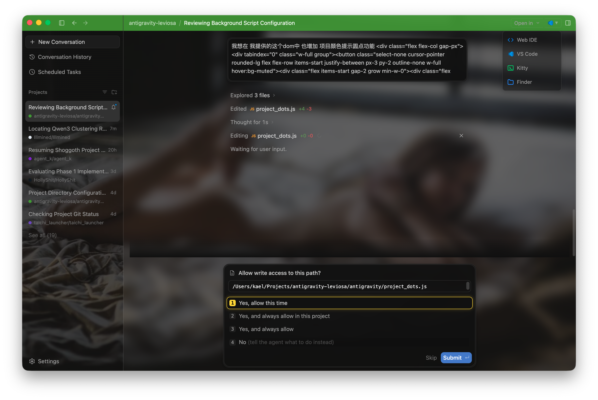
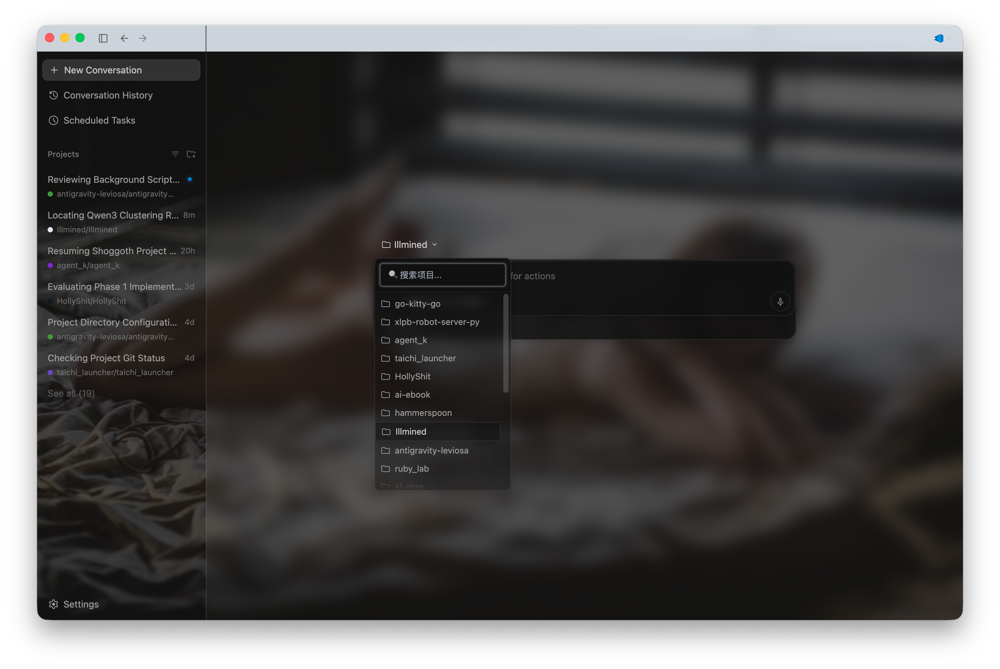

# Antigravity Leviosa

<p align="center">
  
  
</p>

## What's in the Box? 

- 🌠 **Soul-Infused Wallpaper**: How can you even write code with a soul without a custom background image?<br>
  🌠 **注入背景图**：没有背景图，怎么能写出有灵魂的代码！

- 🎨 **Peacock Topbar**: Reuses your VS Code Peacock extension configs, saving you from the absolute tragedy of running a command in the wrong project.<br>
  🎨 **孔雀顶栏**：复用 Peacock 插件的配置，避免了把某个项目的指令发送到另一个项目的悲剧。

- 🟢 **Peacock Indicator Dots**: The native project grouping is ugly and un-sortable. Lighting up these colored indicators is the only way to survive.<br>
  🟢 **孔雀提示灯**：按项目分组太丑还不能排序，只有开提示灯才能维持生活啊。

- 🔍 **Project Search Filter**: Because Google engineers probably only have one project... or they're secretly using Claude Code.<br>
  🔍 **项目列表搜索**：Google 的工程师可能只有一个项目，或者他们其实用的是 Claude Code...

- 🖱️ **Permission UX Overhaul**:Double-click to submit, plus highlighted borders. Isn't this basic UX? This Electron app's interaction design is literally worse than a CLI...<br>
  🖱️ **权限操作优化**：支持双击提交，增加高亮边框（这不基操么，Electron 交互做得连 CLI 都不如的玩意儿...


## Background

Google decided to bless us with a whole bunch of updates on May 20th:

More colour Gemini web and app with STRANGE (aka Ugly) Chinese typography (I'm sure AI wrote the i18n code...)

Antigravity became an AI-first dashboard, and the original IDE mode got renamed to *Antigravity IDE*. All the original data got hooked up to the new Antigravity (where a single conversation is treated as a project). Meanwhile, the data in the IDE went... completely wiped out. (Seriously, does any PM actually have the authority to make a decision like this?)


So Antigravity? Well... Gemini is smart, but *only* inside Antigravity. After all, it's tens of light years away — you literally *need* Antigravity to not look like an idiot.


Be fair, the dashboard is cool, especially for someone with as many concurrent projects as me (or those who are forced to split themselves into multiple clones...). And it should be Antigravity's destined role (we already have too many VS Code clones out there...).

 However, switching projects on the old panel was painfully slow. But now, it is as smooth as butter so be glad to unload Antigravity IDE now! (since it become pure white and with almost twice size of the dashboard..)


Sure, the dashboard still has a few clunky spots, and RIP to our VS Code extensions. But hey, thanks to Electron, we can just hit it with a good ol' *Leviosa*!

## Quick Start 快速开始

At its core, this extension works by injecting custom JavaScript and CSS directly into the dashboard to override the default UI and introduce new behaviors. While many features run entirely in the browser, some dynamic functionalities rely on querying a local data source.

**核心原理**：本质上，这个扩展是通过直接向面板注入自定义的 JavaScript 和 CSS 来覆盖默认 UI 并引入新功能的。虽然很多功能完全在浏览器内运行，但部分动态功能需要依赖于查询本地数据源。

> 🇨🇳 [点击这里中文版指南](./QUICKSTART_zh.md)

To get everything up and running, follow these three steps:

### Step 1: Download the Scripts
First, you need to get the extension files onto your local machine:
1. Clone or download this repository to your preferred directory:
   ```bash
   git clone https://github.com/catclever/antigravity-leviosa.git
   ```
2. Note the absolute path to this directory, as you'll need it for the configuration step.

### Step 2: Setup the Local Data Source
To unlock the full potential of this extension, you'll need a local API endpoint running in the background. You have two ways to set this up:

#### Method 1: The "Taichi" Way (Recommended, Mac Only)
This extension is designed to work seamlessly with my local **Taichi** service (currently Mac Only), which acts as the primary data source for these dynamic configurations. 

1. Clone and start the Taichi service: `https://github.com/catclever/taichi`
2. Simply copy the **entire** downloaded folder from Step 1 into your Taichi's local scripts directory. (This folder contains both our UI scripts and the `taichi_theme_sync.js` backend plugin that Taichi needs).
3. Once Taichi is running locally, it automatically hosts these files and exposes the required endpoint at `http://127.0.0.1:9216`.
4. You're good to go!

#### Method 2: The DIY Mock Server
If you don't want to pull the entire Taichi repo, no worries! You can easily spin up a tiny local mock server to satisfy the API requirements. 

*(Note: If you use this method, you can completely ignore the `taichi_theme_sync.js` file included in the download, as your mock server will handle that job instead!)*

> *Note: The extension expects a GET request to `http://127.0.0.1:9216/api/script/taichi_theme_sync?project=<name>`. The path name `taichi_theme_sync` comes from the fact that it's executed as a specific script within the Taichi environment. We are simply using the exact same path here in our mock server to ensure full compatibility without having to modify the extension's code!*

We have prepared two quick-start guides depending on your preferred language. Click the links below for the full scripts:
- [Using Node.js (Quick & Easy)](./mock_server_node.md)
- [Using Python 3](./mock_server_python.md)

Whichever method you choose, ensure the service is running before proceeding to the final step.

### Step 3: Configure Antigravity
Finally, you need to tell the Antigravity dashboard to load these custom scripts.

1. In the Antigravity dashboard, open the Developer Tools by pressing `Command + Option + I` (on Mac).
2. Navigate to the **Sources** tab.
3. In the left panel (you might need to click the `>>` icon), select **Snippets** and create a new snippet.
4. Enter the following code into the snippet editor:
   ```javascript
   import('http://127.0.0.1:9216/src/antigravity/main.js')
   ```
   *(Note: The port and endpoint here should match your configuration. If you used the DIY mock server in Step 2 instead of Taichi, you'll need to ensure your local server also serves the directory containing `main.js` statically at this path).*
5. Right-click the snippet name and select **Run** (or press `Command + Enter`) to execute the code.

## Important Notes 注意事项

- **Re-injection Required:** Since we are dynamically injecting this mod via Developer Tools, it will not persist across app restarts. Every time you fully quit and reopen the Antigravity dashboard, you will need to re-run the Snippet (Step 3).<br>
  **每次重启需重新注入**：通过开发者工具动态注入的功能不会在应用重启后驻留。每次完全退出并重新打开 Antigravity 后，你都需要重新运行一次 Snippet（即重复第三步）。
- **Google "Moves Fast and Breaks Things":** Antigravity is an actively updated product. Future updates to their dashboard's DOM structure or React components might cause some of these features to temporarily or permanently break. (Honestly, I hope Google just natively integrates these features soon so we don't have to keep injecting scripts...)<br>
  **速生速死**：Antigravity 是一个在积极更新的产品。如果未来 DOM 结构或者 React 组件发生重大变动，可能会导致某些功能暂时或者永久失效。（早用早享受哦~）

## Features & Configuration

Every feature in this mod is cleanly separated into its own module. Here is a breakdown of what each script does and how you can tweak it:

### 1. `main.js` (The Entry Point)
This is the conductor that imports and initializes all other modules.
- **Customization:** If you don't like a specific feature (e.g., the background image), you can easily disable it by simply commenting out its `initX()` function call. This is also the place to import and initialize any of your own custom feature scripts!

### 2. `api.js` (The Data Bridge)
Handles the communication between the dashboard and your local data source (Taichi or Mock Server) to fetch project theme colors.
- **Caching:** To keep the UI snappy and avoid spamming your local service, this module features a built-in L2 memory cache with a Time-To-Live (TTL) of **1 hour**.
- **Color Extraction Mechanism:** The theme colors depend on the `.vscode/settings.json` located in your local project folders. When requesting colors, the backend script employs a highly robust scanning mechanism:
  1. **Multi-Root Workspace Parsing:** It splits comma-separated project names (common in VS Code multi-root setups) and scans each sub-project sequentially.
  2. **Exact Matching:** It searches for an exact folder match in your configured root directories.
  3. **Fuzzy Matching:** If an exact match fails, it automatically falls back to finding any directory whose name *contains* the requested project name, ensuring colors are found even if the UI truncates the name.
- **🚨 CRITICAL CONFIGURATION:** For this to work, you **MUST** explicitly define the absolute paths to your project directories in your backend script (`antigravity_theme_sync.js` or your custom server). Otherwise, the backend won't know where to look for your `.vscode` folders!

### 3. `background.js` (Workspace Background)
Injects a custom background image into the dashboard along with some base CSS tweaks to make the UI look gorgeous.
- **Customization:** By default, the `bgImage` variable in this script is left empty for you to supply your own Base64 image string or a direct image URL. Feel free to dive into the CSS within this file to explore and tweak properties like the background blur (`backdrop-filter: blur(...)`), overlay opacity, and layout spacing to match your exact aesthetic preferences!

### 4. `topbar_color.js` (Dynamic Topbar)
Dynamically changes the topbar's background color based on the project you are currently viewing. It automatically calculates the color luminance to ensure the text remains readable (intelligently switching between dark and light text).

### 5. `project_dots.js` (Project Indicators)
Adds a slick, colored indicator dot next to the project names in the sidebar or subtitles, giving you a quick visual cue of your current project context.
- **⚠️ Limitation:** Please note that this feature currently only works if your Antigravity conversation list is set to **"No Grouping"** and uses the **"Workspace"** as the subtitle.

### 6. `project_search.js` (Project Filter)
Injects a highly responsive search box directly into the project selection popover dialog. Since the new dashboard groups conversations into a massive list, this makes filtering and finding your specific project a breeze!

### 7. `double_click_submit.js` (Fast Submit & UI Polish)
Adds a slick golden border and glow to the currently selected radio button options in dialogs, making it much clearer what you have selected. More importantly, it introduces a "click-again to submit" behavior: if you click an already-selected radio option, it will automatically find and trigger the "Submit" button for you. This dramatically speeds up interactions when dealing with multiple-choice workflows!

## Todos
- 🐱 **KitiGravity**: God might have given us a hundred ways to open a terminal, but who could possibly resist summoning a kitty with a single click?<br>**🐱 KitiGravity**：虽然上帝给了100种打开终端的方式，但是谁能拒绝一键召唤小猫呢？
- 💻 **VSGGravity**: Even if it absolutely has to be opened in an IDE, Google probably pick Antigravtity IDE...But why not VSCode?<br>💻 **VSGGravity**：就算一定要在IDE中打开，Google应该也不会选它吧？但是为什么不选它呢？
- ⚡ **ZediGravity**: Did you say IDE? Step aside, you sins of Electron!<br>⚡ **ZediGravity**：你说IDE？就让我来涤荡Eletron的罪孽吧！
- ……

**幸甚至哉，鸽以咏志！**

（如果你看得懂，请不要尝试翻译，把它留给ai吧...）